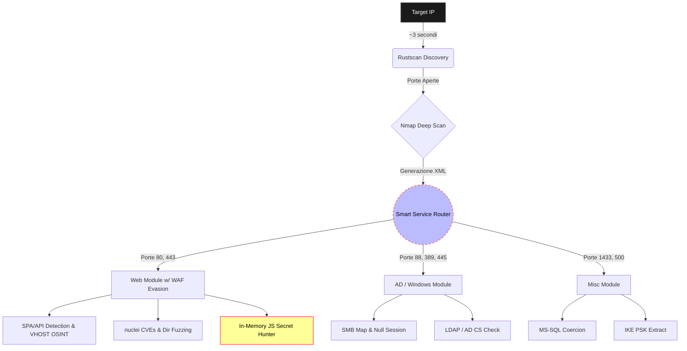

# LazyPwn v1.0 – Asynchronous CTF Orchestrator

    

> *"I choose a lazy person to do a hard job. Because a lazy person will find an easy way to do it."* - Bill Gates

## 1. Executive Summary

LazyPwn nasce da un'esigenza pratica incontrata durante le sessioni su Hack The Box e gli ambienti CTF: automatizzare la fase iniziale di ricognizione e delegare i task ripetitivi. Fare la scimmia dattilografa copiando sempre gli stessi 15 comandi nmap non è divertente, rischiare di doverlo rifare perché si è sbagliata la sintassi è pure peggio.

L'idea era quello di essere uno script wrapper per snellire la fase iniziale, ma man mano ho aggiunto elementi. Non fa solo solo enumerazione ma riconosce gli stack tecnologici, analizza i JavaScript alla ricerca di dati sensibili hardcoded, bypassa i WAF tramite throttling dinamico e tenta attivamente l'Auto-Breaching via Credential Spraying se sniffa qualche credenziale valida. L'obiettivo è far preparare tutto il terreno ed indirizzare correttamente durante la fase iniziale.

---

## 2. Architettura e Workflow

Il progetto si basa su un core `asyncio` progettato per ottimizzare i tempi seguendo una pipeline logica.

- **Blazing Fast Pipeline:** La fase di discovery iniziale sfrutta `rustscan` per un rilevamento delle porte fulmineo. I risultati pipe-ano dritti dentro `nmap` per deep service identification, eliminando il bisogno del parametro `-p-`.
- **Context-Aware Fuzzing & WAF Evasion:** LazyPwn parsa gli header e le HTTP response per riconoscere le Single Page Applications (React, Vue, Node). Se fiuta che un WAF lo sta bloccando, attiva in automatico il throttling dinamico e la rotazione dello User-Agent. Tenta di fare anche OSINT via crt.sh per scovare VHOST nascosti o sottodomini API.
- **Smart Service Router:** A seconda delle porte rilevate, lancia moduli paralleli in background autonomamente.

### Pipeline di Esecuzione

---

## 3. The Secret Hunter & Auto-Dumper

Visto che analizzare i JavaScript (con `wget` o deveopers tool) richiedeva troppo tempo e si rischia di sorvolare su dati che magari non saltano all'occhio. Automatizzare questo scraping risulta quindi più efficace oltre che efficiente.

L'**Auto-Dumper** tira giù attivamente i file `.env`, esporta magicamente intere root `.git` se scoperte e si frega le docs OpenAPI/Swagger in locale. Inoltre il **Secret Hunter** tira giù *tutti* i `.js` linkati nella pagina, li butta in memoria, se li parsa (anche se minified) e tira fuori via *regex* JWT, chiavi AWS e API Tokens al volo (ovviamente in caso trovate).

_"Zero Sbatti"_:  
    Se c'è un token "Administrator" dumpato alla riga 12.000 di `app.bundle.44.chunk.js`, LazyPwn lo estrae e lo stampa a schermo senza che tu debba mai aprire un browser.

---

## 4. Auto-Breach (Weaponization)

Perché limitarsi a loggare le credenziali trovate se abbiamo accesso a SSH o SMB? Dato che fare ripetutamente copia-incolla da `secrets.txt` nei prompt di login era faticoso, ho implementato l'**Auto-Breaching**.

Quando LazyPwn becca una password, un JWT valido, token vari o NTLM grezza durante le sue scansioni, si accoda silenziosamente un task parallelo e lancia un attacco di Credential Spraying usando tool come `netexec` contro i servizi validi trovati. Se prende la sessione, ti ritrovi l'accesso salvato ed hai risparmiato tempo e fatica.

---

## 5. Modulo di Post-Exploitation (Arsenal)

Ottenuto l'accesso iniziale alla macchina, stabilizzare la maledetta reverse shell e trasferire binari per l'escalation è sempre il gradino immediatamente successivo (nonché il più fastidioso). Buttando un bel flag `--shell`, LazyPwn si trasforma nel tuo **Post-Exploitation Buddy**.

*"It's dangerous to go alone!"*  
Quando ottieni una shell "dumb" tramite un web exploit, perdi history dei comandi, per sbaglio premi `Ctrl+C` e killi la tua stessa magica shell costringendoti a rifare tutto da capo... è letteralmente momento di usare il modulo shell.

1. **Auto-Discovery:** Rileva in automatico l'IP locale della tua interfaccia VPN (`tun0`).
2. **Payload Staging:** Tira sù un server HTTP Python per hostare la tua cartella `/tools` per roba come LinPEAS/winPEAS.
3. **Weapon Forging:** Lancia dinamicamente `msfvenom` per buttare fuori reverse shell ELF (C) pre-configurate sul tuo IP, o shell web PHP/ASPX generandole al fly.
4. **Pivoting Automator:** Genera la sintassi bash perfetta copioncollabile per fare il tunnel Chisel di ritorno alla tua macchina senza errori di battitura.
5. **TTY Escaping:** Stampa la famosa block chain `python3 -c 'import pty...; pty.spawn("/bin/bash")'` seguita da `stty raw -echo` così fai letteralmente solo due click.

---

## 6. Gestione dello Stato e Quality of Life

Le connessioni VPN esplodono sempre durante le CTF; per ovviare si usa un **JSON State Manager** (`state.json`) che tiene a memoria cosa o quali script sono completati.

*QoL - (Quality of Life)*
    - **Auto-Chown:** Hai presente l'ansia di farti dumpare nmap report protetti da `root` che poi per leggerli o cancellarli devi fare il `sudo chown` ovunque? Finito. LazyPwn fa hook di se stesso a fine pipeline e ti ridà i permessi utente ai file. 
    - **Webhooks:** Scansione finita? Uno script in background ti passa il bot di Slack o Discord con le info, porte, e loot trovato via message sul tuo canale privato.
    - **Interactive HTML Report:** Tutto quello che è stato dumpato viene convertito via generator in HTML per una miglior lettura.

---

## 💻 Codice Sorgente & Open Source

LazyPwn è un progetto interamente open source rilasciato sotto licenza **GNU GPL v3**. Tutto il codice sorgente, l'architettura e i vari moduli sono disponibili pubblicamente. Se vuoi spulciare il codice, fare una pull request o semplicemente usarlo per la tua prossima CTF, trovi tutto qui: **[Visita la repository su GitHub](https://github.com/marcop-sed/lazypwn)**.

