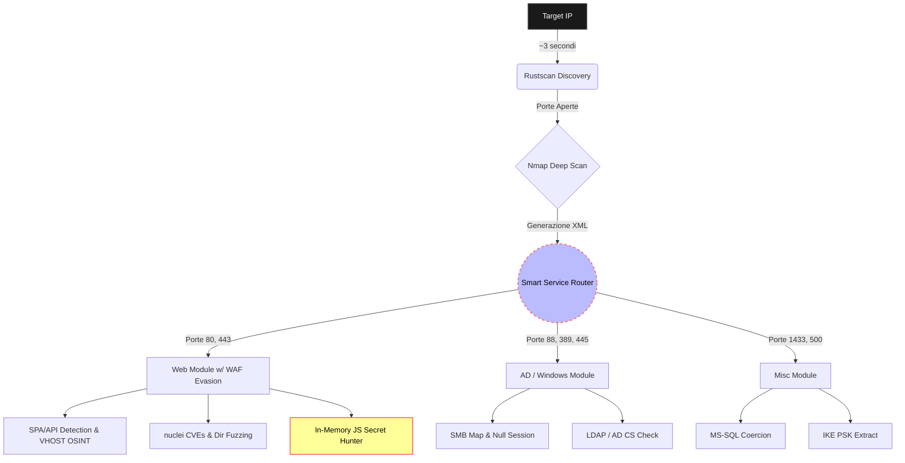

# LazyPwn v1.0 – Asynchronous CTF Orchestrator

    

> *"I choose a lazy person to do a hard job. Because a lazy person will find an easy way to do it."* — Bill Gates (probabilmente parlando di CTF)

## 1. Executive Summary

LazyPwn v1.0 nasce da un'esigenza pratica incontrata durante le sessioni su Hack The Box e gli ambienti CTF: automatizzare la fase iniziale di ricognizione e delegare i task ripetitivi. Fare la scimmia dattilografa copiando sempre gli stessi 15 comandi nmap non è fare hacking.

Da semplice script wrapper, LazyPwn è rapidamente mutato in un **orchestratore asincrono "Context-Aware"** basato ad eventi, scritto in Python 3.10+. Non fa solo pura enumerazione stupida: riconosce gli stack tecnologici in tempo reale, estrae segreti in memoria dai file JavaScript, bypassa i WAF tramite throttling dinamico e tenta attivamente l'Auto-Breaching via Credential Spraying se sniffa qualche credenziale valida. L'obiettivo è fargli preparare tutto il terreno, togliere di mezzo la noia, e fornirti un arsenale pronto all'uso, lasciandoti più tempo per focalizzarti sulla logica di exploit invece che farti digitare robe a mano.

---

## 2. Architettura e Workflow

Il progetto si basa su un core `asyncio` progettato per ottimizzare brutalmente i tempi morti. La pipeline è diventata parecchio paranoica e intelligente.

- **Blazing Fast Pipeline:** La fase di discovery iniziale sfrutta `rustscan` per un rilevamento delle porte fulmineo. I risultati pipe-ano dritti dentro `nmap` per deep service identification, eliminando per sempre la noia del parametro `-p-`.
- **Context-Aware Fuzzing & WAF Evasion:** LazyPwn parsa gli header e le HTTP response per riconoscere le Single Page Applications (React, Vue, Node). Se fiuta che un WAF lo sta bloccando, attiva in automatico il throttling dinamico e la rotazione dello User-Agent. Ah, fa anche OSINT via crt.sh per sputare fuori VHOST nascosti o sottodomini API.
- **Smart Service Router:** A seconda delle porte rilevate, lancia moduli paralleli in background autonomamente. Zero sbatti.

### Pipeline di Esecuzione

---

## 3. The Secret Hunter & Auto-Dumper

Siamo nel 2026. È incredibile ma la gente hardcoda ancora i token nei bundle JS in produzione. Mi ero troppo stancato di dover ispezionare tutta la roba nei Developer Tools, quindi ho automatizzato tutto.

LazyPwn non ti dice più solo "Ehi, c'è una porta aperta". L'**Auto-Dumper** tira giù attivamente i file `.env`, esporta magicamente intere root `.git` se scoperte e si frega le docs OpenAPI/Swagger in locale. Ma il fiore all'occhiello è il **Secret Hunter**: tira giù *tutti* i `.js` linkati nella pagina, li butta in memoria, se li parsa (anche se minified) e tira fuori via Regex incazzate JWT, chiavi AWS e API Tokens al volo.

!!! info "Zero Sbatti Required"
    Se c'è un token "Administrator" dumpato alla riga 12.000 di `app.bundle.44.chunk.js`, LazyPwn lo estrae e te lo stampa a schermo senza che tu debba mai aprire un browser.

---

## 4. Auto-Breach (Weaponization)

Perché limitarsi a loggare le credenziali trovate se abbiamo accesso a SSH o SMB? Dato che fare ripetutamente copia-incolla da `secrets.txt` nei prompt di login faceva troppa fatica, ho implementato l'**Auto-Breaching**.

Quando LazyPwn becca una password, un JWT valido o roba NTLM grezza durante le sue scansioni, si accoda silenziosamente un task parallelo e lancia un attacco di Credential Spraying usando tool come `netexec` contro i servizi validi trovati. Se prende la sessione, ti ritrovi l'accesso salvato. Praticamente ti svegli con la macchina già bucata.

---

## 5. Modulo di Post-Exploitation (Arsenal)

Ottenuto l'accesso iniziale alla macchina, stabilizzare la maledetta reverse shell e trasferire binari per l'escalation è sempre il gradino immediatamente successivo (nonché il più fastidioso). Buttando un bel flag `--shell`, LazyPwn si trasforma nel tuo **Post-Exploitation Buddy**.

!!! warning "It's dangerous to go alone!"
    Quando ottieni una shell "dumb" tramite un web exploit, perdi history dei comandi, per sbaglio premi `Ctrl+C` e killi la tua stessa magica shell costringendoti a rifare tutto da capo... è letteralmente momento di usare il modulo shell.

1. **Auto-Discovery:** Rileva in automatico l'IP locale della tua interfaccia VPN (`tun0`).
2. **Payload Staging:** Tira sù in 1 decimo di secondo un server HTTP Python per hostare la tua cartellina `/tools` per roba come LinPEAS/winPEAS.
3. **Weapon Forging:** Lancia dinamicamente `msfvenom` per buttarti fuori reverse shell ELF (C) pre-configurate sul tuo IP, o shell web PHP/ASPX generandole on the fly.
4. **Pivoting Automator:** Genera la sintassi bash perfetta copioncollabile per fare il tunnel Chisel di ritorno alla tua macchina senza errori di battitura.
5. **TTY Escaping:** Stampa la famosa block chain `python3 -c 'import pty...; pty.spawn("/bin/bash")'` seguita da `stty raw -echo` così fai letteralmente solo due click.

---

## 6. Gestione dello Stato e Quality of Life

Le connessioni VPN esplodono sempre nei CTF. LazyPwn usa un **JSON State Manager** (`state.json`) che tiene a memoria cosa o quali script sono completati.

!!! tip "Quality of Life (Per i Pigri Veri)"
    La v1.0 di LazyPwn porta tre QoL assurde:
    - **Auto-Chown:** Hai presente l'ansia di farti dumpare nmap report protetti da `root` che poi per leggerli o cancellarli devi fare il `sudo chown` ovunque? Finito. LazyPwn fa hook di se stesso a fine pipeline e ti ridà i permessi utente ai file. 
    - **Webhooks:** Scansione finita. Script in background ti passa il bot di Slack o Discord con le info, porte, e loot trovato via message sul tuo canale privato.
    - **Interactive HTML Report:** Tutto quello che dumpato, convertito via generator e sputato sul tuo hard disk come HTML per potersi leggere senza gli occhi da terminale.

---

## 💻 Codice Sorgente & Open Source

LazyPwn è un progetto interamente open source rilasciato sotto licenza **GNU GPL v3**. Tutto il codice sorgente, l'architettura asincrona e i vari moduli sono disponibili pubblicamente. Se vuoi spulciare il codice, fare una pull request o semplicemente usarlo per la tua prossima CTF, trovi tutto qui: **[Visita la repository su GitHub](https://github.com/marcop-sed/lazypwn)**.

