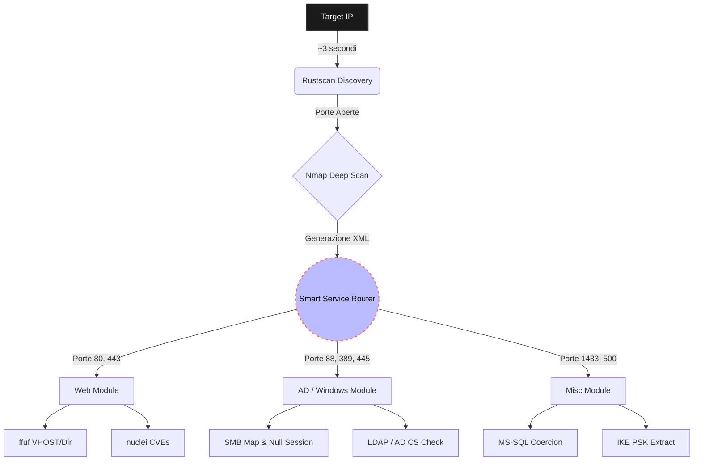

# LazyPwn – Asynchronous CTF Orchestrator

  

> *"I choose a lazy person to do a hard job. Because a lazy person will find an easy way to do it."* — Bill Gates (probabilmente parlando di CTF)

## 1. Executive Summary

LazyPwn nasce da un'esigenza pratica incontrata durante le sessioni su Hack The Box e gli ambienti CTF: automatizzare la fase iniziale di ricognizione e delegare i task ripetitivi. 
Invece di ricorrere a un classico script bash sequenziale per mettere in catena dozzine di tool standard, ho ingegnerizzato un **orchestratore asincrono e ad eventi** scritto in Python 3.10+. L'obiettivo non è sostituirsi all'operatore con "auto-hacking", ma preparare il terreno in modo rapido, estrarre dati di enumerazione e fornire payload di base pronti all'uso, lasciando più tempo per l'analisi della logica di exploit.

---

## 2. Architettura e Workflow

Il progetto si basa su un core `asyncio` progettato per ottimizzare i tempi di attesa morti. Le feature principali includono:

- **Blazing Fast Pipeline:** La fase di discovery iniziale sfrutta `rustscan` per un rilevamento quasi istantaneo delle porte. I risultati vengono passati direttamente a `nmap` per un'identificazione approfondita dei servizi, evitando i classici scan `-p-` infiniti.
- **Smart Service Router:** LazyPwn esegue un parsing al volo in memoria dell'XML generato da Nmap. A seconda delle porte aperte rilevate, lancia autonomamente in background moduli specifici in parallelo.

### Pipeline di Esecuzione



## 3. Gestione dello Stato e Resilienza

Chiunque abbia fatto CTF sa che le connessioni VPN possono cadere da un momento all'altro. Per ovviare al problema di dover ricominciare da capo le lunghe fasi di recon, LazyPwn implementa uno **State Manager** basato su JSON (`state.json`). 

L'orchestratore registra l'output e lo stato di completamento di ogni singolo task. In caso di crash, il logic flow è banale ma salva la vita:

```python
# Snippet concettuale: State Manager in azione
async def execute_tool(tool_name: str, cmd: str, state: dict):
    if state.get(tool_name) == "COMPLETED":
        log.info(f"Skipping {tool_name}, già fatto. 🦥")
        return
        
    log.info(f"Avvio {tool_name} in background...")
    await run_subprocess(cmd)
    
    # Aggiorna lo stato in modo transazionale
    state.update(tool_name, "COMPLETED")
    save_state_to_json(state)
```

!!! tip "Zero Sbatti"
    Se perdi la connessione VPN a metà dello scan di `nuclei`, ti basterà rilanciare lo script. `rustscan` e `nmap` verranno ignorati e bypassati, e lo scanning web ripartirà da dove ci si aspettava.

---

## 4. Modulo di Post-Exploitation

Ottenuto l'accesso iniziale alla macchina, stabilizzare la reverse shell e trasferire binari per l'escalation è sempre il gradino immediatamente successivo (e solitamente il più noioso da digitare). Ho integrato una modalità `--shell` di supporto.

!!! warning "It's dangerous to go alone!"
    Quando ottieni una shell "dumb" tramite un exploit web web, perdi l'history dei comandi, premi incautamente `Ctrl+C` e killi la tua stessa sessione per sbaglio... è letteralmente il momento di usare la modalità shell.

1. **Auto-Discovery:** Rileva in automatico l'indirizzo IP locale assegnato all'interfaccia VPN (`tun0`).
2. **Payload Staging:** Avvia un server HTTP Python servendo temporaneamente una cartella locale `tools/` (pratico per hostare script come `LinPEAS` o `winPEAS`).
3. **TTY Escaping:** Stampa a schermo i blocchi di comandi pronti da copia-incollare per sfuggire all'ambiente "dumb shell" (la famigerata combo `python3 -c 'import pty...'` seguita dalle magiche configurazioni `stty`).

