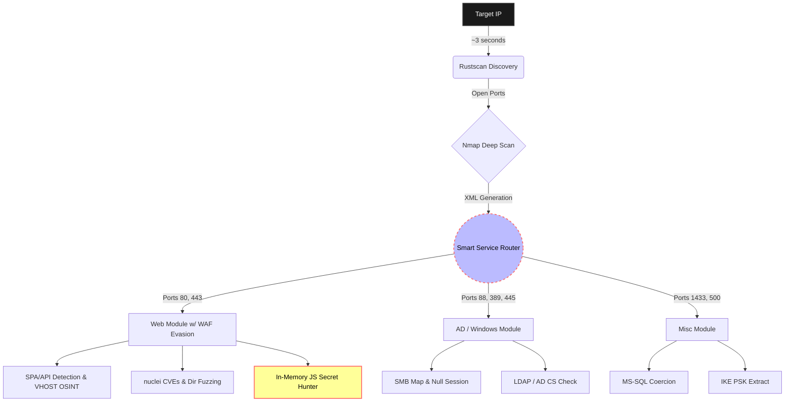

# LazyPwn v1.0 – Asynchronous CTF Orchestrator

  

> *"I choose a lazy person to do a hard job. Because a lazy person will find an easy way to do it."* — Bill Gates (probably talking about CTFs)

## 1. Executive Summary

LazyPwn v1.0 stems from a practical need encountered during Hack The Box sessions and similar CTF environments: automating the initial reconnaissance phase and delegating repetitive tasks to the machine. You should not have to be a monkey typing the same commands over and over.

Originally a basic wrapper script, LazyPwn has rapidly mutated into a **Context-Aware, asynchronous event-driven orchestrator** written in Python 3.10+. It doesn't just do enumeration—it recognizes tech stacks in real-time, extracts in-memory secrets from JavaScript files, evades WAFs, and actively attempts Auto-Breaching via Credential Spraying if it sniffs a valid credential. The goal is to lay all the prep work, handle the annoying enumerations, and dump a ready-to-use arsenal in your lap, leaving you actual time to focus on the proper exploit logic instead of manual drudgery.

---

## 2. Architecture and Workflow

The project relies on an `asyncio` core designed to drastically cut down idle waiting times. The pipeline has gotten significantly smarter and more paranoid.

- **Blazing Fast Pipeline:** The initial port discovery leverages `rustscan` for almost instantaneous detection. Results are piped directly into `nmap` for deep service identification, skipping the usual endless `-p-` scans.
- **Context-Aware Fuzzing and WAF Evasion:** LazyPwn parses HTTP headers and responses to detect Single Page Applications (SPA) built with React, Vue, or Node.js. It automatically toggles dynamic throttling and User-Agent rotation if it detects a WAF kicking it to the curb. Oh, and it uses crt.sh to perform OSINT to unearth forgotten VHOSTs and API subdomains.
- **Smart Service Router:** Depending on the discovered open ports, it autonomously triggers specific parallel modules in the background.

### Execution Pipeline

---

## 3. The Secret Hunter & Auto-Dumper

It's 2026. Hardcoded secrets are still being pushed to production JavaScript bundles. I got tired of manually checking Developer Tools, so I automated the whole thing.

LazyPwn no longer just logs "Hey, I found an endpoint". The **Auto-Dumper** dynamically pulls `.env` files, attempts to recursively dump exposed `.git` directories, and grabs OpenAPI/Swagger documentation. But the real jewel of the crown is the **Secret Hunter**: it fetches every single loaded `.js` file, holds it in memory, parses the minified chunks, and rips out JWTs, AWS Access Keys, and API tokens on the fly using heavy Regex. 

!!! info "Zero Effort Required"
    If there is a hardcoded "Administrator" token buried inside `app.bundle.44.chunk.js`, LazyPwn will extract it and drop it directly into your lap without you ever having to open a browser.

---

## 4. Auto-Breach (Weaponization)

Why stop at finding credentials if we have access to the services where they belong? Because doing copy-paste from `secrets.txt` to SSH login prompts was too much work, I implemented **Auto-Breaching**.

When LazyPwn identifies passwords, JWTs, or raw NTLM pieces during its run, it silently queues up a parallel credential spraying attack against discovered SSH and SMB services using tools like `netexec`. If it hooks a valid session, it secures the persistent access automatically. You essentially wake up to an already breached system.

---

## 5. Post-Exploitation Arsenal

Once initial access to a target is achieved, stabilizing the reverse shell and prepping escalation binaries is always the very next step (and usually the most boring one to type). By adding the `--shell` flag, you turn LazyPwn into a **Post-Exploitation Buddy**.

!!! warning "It's dangerous to go alone!"
    When you get a "dumb" shell via a web exploit, lose your command history, hit `Ctrl+C` heedlessly, and accidentally kill your own session... it is literally time to use the shell mode.

1. **Auto-Discovery:** Automatically detects the local IP address assigned to the VPN interface (`tun0`).
2. **Payload Staging:** Starts a local Python HTTP server temporarily hosting a local `tools/` directory.
3. **Weapon Forging:** Dynamically runs `msfvenom` to compile ELF C reverse shells tailored to your IP. It even generates PHP/ASPX web shells on the fly.
4. **Pivoting Automator:** Drops the exact bash commands to set up a Chisel proxy back to your machine. 
5. **TTY Escaping:** Displays copy-paste ready command blocks to escape the "dumb shell" environment (the infamous `python3 -c 'import pty...; pty.spawn("/bin/bash")'` chunk, coupled with the magic `stty raw -echo` configs).

---

## 6. State Management & Quality of Life

Anyone playing CTFs knows that VPN connections can drop unexpectedly. To solve the issue of having to start long recon phases from scratch, LazyPwn implements a JSON-based **State Manager** (`state.json`). It remembers exactly what it already scanned.

!!! tip "Quality of Life Improvements"
    LazyPwn v1.0 also pushes heavy QoL features:
    - **Auto-Chown:** Ever hate getting `Permission Denied` because Nmap `sudo` scans created folders owned by root? LazyPwn intercepts the process and chowns the generated loot/folders back to your user account automatically.
    - **Webhooks:** A completed run doesn't just stop. It pushes the extracted loot directly to your Discord or Slack channel via webhooks.
    - **Interactive HTML Report:** At the end of the pipeline, it compiles a slick, responsive HTML summary so you can easily review the attack surface.

