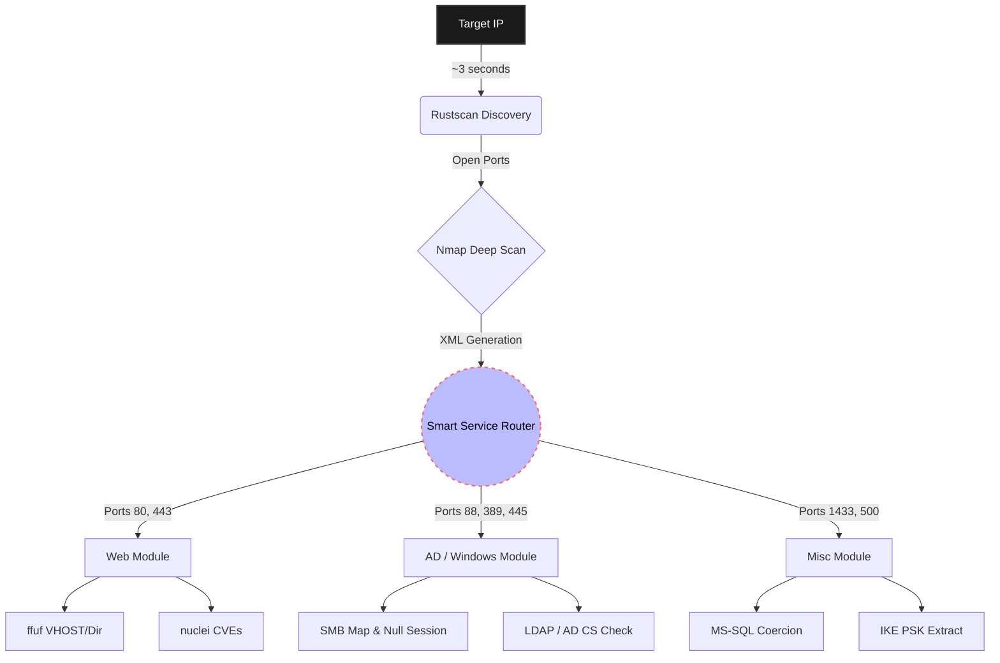

# LazyPwn – Asynchronous CTF Orchestrator

  

> *"I choose a lazy person to do a hard job. Because a lazy person will find an easy way to do it."* — Bill Gates (probably talking about CTFs)

## 1. Executive Summary

LazyPwn stems from a practical need encountered during Hack The Box sessions and similar CTF environments: automating the initial reconnaissance phase and delegating repetitive tasks to the machine. You should not have to be a monkey typing the same commands over and over.
Instead of resorting to a classic sequential bash script to chain dozens of standard tools, I engineered an **asynchronous, event-driven orchestrator** written in Python 3.10+. The goal is not to replace the operator with "auto-hacking", but to lay the groundwork quickly, extract enumeration data, and provide ready-to-use base payloads, leaving more time to focus on exploit logic.

---

## 2. Architecture and Workflow

The project relies on an `asyncio` core designed to drastically cut down idle waiting times. The main features include:

- **Blazing Fast Pipeline:** The initial port discovery leverages `rustscan` for almost instantaneous detection. Results are piped directly into `nmap` for deep service identification, skipping the usual endless `-p-` scans.
- **Smart Service Router:** LazyPwn parses Nmap's XML outputs on the fly in memory. Depending on the discovered open ports, it autonomously triggers specific parallel modules in the background.

### Execution Pipeline



## 3. State Management and Resilience

Anyone playing CTFs knows that VPN connections can drop unexpectedly. To solve the issue of having to start long recon phases from scratch, LazyPwn implements a JSON-based **State Manager** (`state.json`). 

The orchestrator logs the output and completion status of every single task. In the event of a crash, the logic flow is basic but life-saving:

```python
# Conceptual Snippet: State Manager in action
async def execute_tool(tool_name: str, cmd: str, state: dict):
    if state.get(tool_name) == "COMPLETED":
        log.info(f"Skipping {tool_name}, already done. 🦥")
        return
        
    log.info(f"Starting {tool_name} in background...")
    await run_subprocess(cmd)
    
    # Transactional state update
    state.update(tool_name, "COMPLETED")
    save_state_to_json(state)
```

!!! tip "Zero Hassle"
    If you lose your VPN connection halfway through a `nuclei` scan, just relaunch the script. `rustscan` and `nmap` will be safely skipped and bypassed, and the web scanning will pick up exactly where it was expected to.

---

## 4. Post-Exploitation Module

Once initial access to a target is achieved, stabilizing the reverse shell and transferring binaries for escalation is always the very next step (and usually the most boring one to type). I integrated a support `--shell` mode.

!!! warning "It's dangerous to go alone!"
    When you get a "dumb" shell via a web exploit, lose your command history, hit `Ctrl+C` heedlessly, and accidentally kill your own session... it is literally time to use the shell mode.

1. **Auto-Discovery:** Automatically detects the local IP address assigned to the VPN interface (`tun0`).
2. **Payload Staging:** Starts a local Python HTTP server temporarily hosting a local `tools/` directory (handy for staging scripts like `LinPEAS` or `winPEAS`).
3. **TTY Escaping:** Displays copy-paste ready command blocks to escape the "dumb shell" environment (the infamous `python3 -c 'import pty...'` combo, followed by the magic `stty` configurations).

