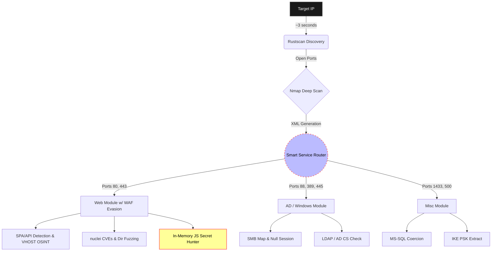

# LazyPwn v1.0 – Asynchronous CTF Orchestrator

    

> *"I choose a lazy person to do a hard job. Because a lazy person will find an easy way to do it."* - Bill Gates

## 1. Executive Summary

LazyPwn stems from a practical need encountered during Hack The Box sessions and CTF environments: automating the initial reconnaissance phase and delegating repetitive tasks. Playing the typing monkey by repeatedly copying the same 15 nmap commands is not fun, and risking having to redo it because of a syntax error is even worse.

The idea was to be a wrapper script to streamline the initial phase, but step by step I added elements. It doesn't just do enumeration but recognizes tech stacks, analyzes JavaScript looking for hardcoded sensitive data, bypasses WAFs through dynamic throttling, and actively attempts Auto-Breaching via Credential Spraying if it sniffs a valid credential. The goal is to have it prep the whole ground and direct you correctly during the initial phase.

---

## 2. Architecture and Workflow

The project relies on an `asyncio` core designed to optimize times following a logical pipeline.

- **Blazing Fast Pipeline:** The initial discovery phase leverages `rustscan` for lightning-fast port detection. The results pipe straight into `nmap` for deep service identification, eliminating the need for the `-p-` parameter.
- **Context-Aware Fuzzing & WAF Evasion:** LazyPwn parses headers and HTTP responses to recognize Single Page Applications (React, Vue, Node). If it sniffs that a WAF is blocking it, it automatically activates dynamic throttling and User-Agent rotation. It also attempts to do OSINT via crt.sh to unearth hidden VHOSTs or API subdomains.
- **Smart Service Router:** Depending on the discovered ports, it launches parallel modules in the background autonomously.

### Execution Pipeline

---

## 3. The Secret Hunter & Auto-Dumper

Since analyzing JavaScripts (with `wget` or developer tools) took too much time and there's a risk of glossing over data that might not catch the eye, automating this scraping is therefore more effective as well as efficient.

The **Auto-Dumper** actively pulls down `.env` files, magically exports entire `.git` roots if discovered, and steals OpenAPI/Swagger docs locally. Furthermore, the **Secret Hunter** pulls down *all* the `.js` linked in the page, throws them in memory, parses them (even if minified) and extracts via *regex* JWTs, AWS keys and API Tokens on the fly (obviously if found).

_"Zero Sbatti"_:
    If there is an "Administrator" token dumped at line 12,000 of `app.bundle.44.chunk.js`, LazyPwn extracts it and prints it on screen without you ever having to open a browser.

---

## 4. Auto-Breach (Weaponization)

Why limit ourselves to logging the found credentials if we have access to SSH or SMB? Since repeatedly copy-pasting from `secrets.txt` into login prompts was tedious, I implemented **Auto-Breaching**.

When LazyPwn hits a password, a valid JWT, various tokens, or raw NTLM during its scans, it silently queues a parallel task and launches a Credential Spraying attack using tools like `netexec` against the valid services found. If it catches the session, you find the access saved and you saved time and effort.

---

## 5. Post-Exploitation Module (Arsenal)

Once initial access to the machine is obtained, stabilizing the damn reverse shell and transferring binaries for escalation is always the immediately next step (as well as the most annoying). By throwing a nice `--shell` flag, LazyPwn turns into your **Post-Exploitation Buddy**.

*"It's dangerous to go alone!"*
When you get a "dumb" shell via a web exploit, lose the command history, accidentally press `Ctrl+C` and kill your own magic shell forcing you to redo everything from scratch... it is literally time to use the shell module.

1. **Auto-Discovery:** Automatically detects the local IP of your VPN interface (`tun0`).
2. **Payload Staging:** Spins up a Python HTTP server to host your `/tools` folder for stuff like LinPEAS/winPEAS.
3. **Weapon Forging:** Dynamically launches `msfvenom` to spit out pre-configured ELF (C) reverse shells on your IP, or PHP/ASPX web shells generating them on the fly.
4. **Pivoting Automator:** Generates the perfect copy-pasteable bash syntax to make the Chisel tunnel back to your machine without typos.
5. **TTY Escaping:** Prints the famous block chain `python3 -c 'import pty...; pty.spawn("/bin/bash")'` followed by `stty raw -echo` so you literally just do two clicks.

---

## 6. State Management and Quality of Life

VPN connections always explode during CTFs; to remedy this, a **JSON State Manager** (`state.json`) is used, keeping in memory what or which scripts are completed.

*QoL - (Quality of Life)*
    - **Auto-Chown:** You know the anxiety of having nmap reports dumped protected by `root` and then to read or delete them you have to do `sudo chown` everywhere? Gone. LazyPwn hooks itself at the end of the pipeline and gives you back user permissions to the files.
    - **Webhooks:** Scan finished? A background script passes you the Slack or Discord bot with the info, ports, and loot found via message on your private channel.
    - **Interactive HTML Report:** Everything that has been dumped is converted via generator into HTML for a better read.

---

## 💻 Source Code & Open Source

LazyPwn is a fully open-source project released under the **GNU GPL v3** license. All the source code, the architecture, and the various modules are publicly available. If you want to dig into the code, make a pull request or simply use it for your next CTF, you find everything here: **[Visit the repository on GitHub](https://github.com/marcop-sed/lazypwn)**.
